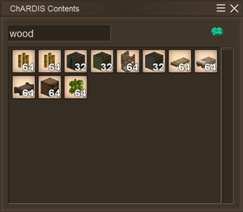
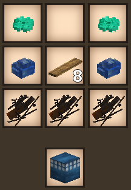

# ChARDIS

This mod adds a large, expandable single-block storage system to the game.

## Crafting

The default recipe takes 2 temporal gears (top left, top right), 2 lapis (middle left, middle right), 8 boards of any kind (center), and 3 metal scraps across the bottom.

## Overview

Use like any normal inventory. The number of slots available starts out at 64 and can be expanded in increments of 16. These are both configurable.

The ChARDIS can be expanded by installing more temporal gears. To do so, simply right click a placed ChARDIS with a temporal gear. There is no hard limit on the number of gears that can be installed at this point.

## Configuration

ChARDIS can be configured by placing a file called ChardisModConfig.json in your ModConfig folder. On first run, a file will be generated for you with the defaults.

### UpgradeItemCode

Set this to the item to use for upgrades. Default: `game:gear-temporal`

### BaseSlots

Set this to the slots the item starts out with. Default: `64`

### SlotsPerUpgrade

Set this to the number of additional slots to add per upgrade. Default: `16`

## Collaboration

I am no artist. If you would like to help improve the look of anything or provide translations, please send me a PR [on GitHub](https://github.com/curquhart/chardis) or contact me on the Vintage Story Discord (my name is MsChelstastic.)

## Bugs & Features

Please feel free to create an issue [on GitHub](https://github.com/curquhart/chardis). If you're reporting a bug, please be as specific as you can be and include a stack trace if applicable.
